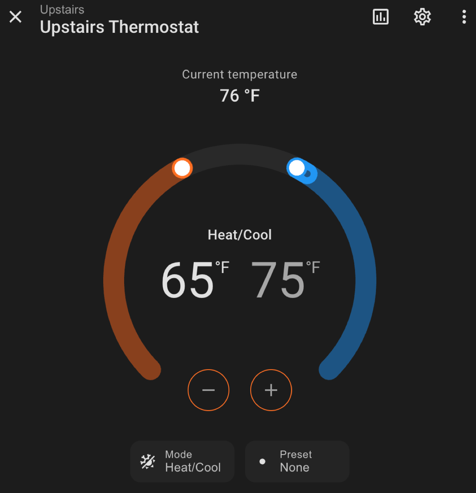
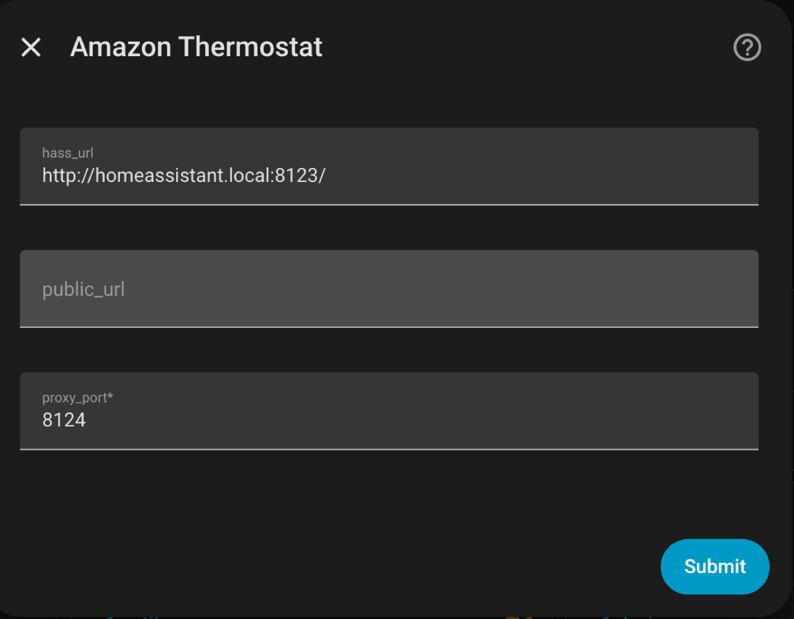
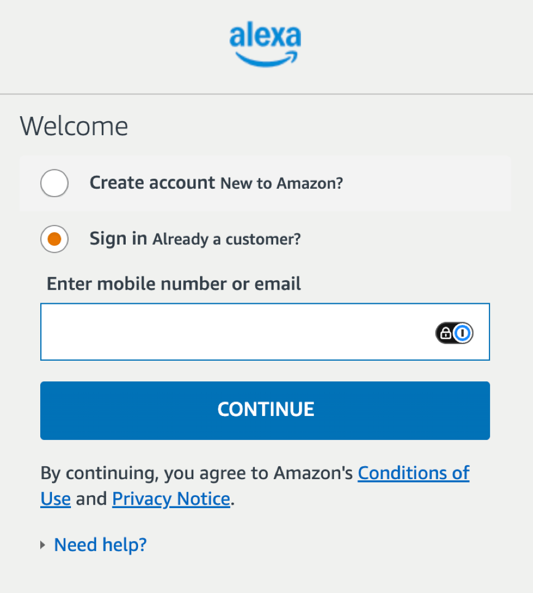

# Amazon Thermostat for Home Assistant

Native Home Assistant custom integration for Alexa-connected thermostats.

This integration is based on the behavior documented from
[`homebridge-alexa-smarthome`](https://github.com/joeyhage/homebridge-alexa-smarthome).
It talks to Amazon's private Alexa Smart Home GraphQL API to discover thermostats,
read current temperature/humidity/mode/setpoints, and send set-temperature commands.



## Current status

Setup uses a Python port of the Homebridge `alexa-cookie2` login flow to open a
guided Amazon login through Home Assistant. This is the only supported
authentication method.

## Supported features

- Alexa thermostat discovery
- Current temperature
- Target temperature
- Heat/cool target range for Alexa `AUTO` mode
- HVAC modes: heat, cool, heat/cool, off

## Known limitations

- Amazon does not provide an official public API for this use case. The private API
  can break without notice.
- Authentication uses an unofficial Alexa web login/device-registration flow;
  Amazon can change this flow without notice.
- Polling is intentionally conservative to reduce rate-limiting risk.

## Installation

### Install with HACS

The easiest way to install this integration is as a HACS custom repository:

1. In Home Assistant, open **HACS**.
2. Go to **HACS > Integrations**.
3. Open the three-dot menu and choose **Custom repositories**.
4. Add this repository URL, for example:

   ```text
   https://github.com/colindembovsky/homeassistant-amazon-thermostat
   ```

5. Set the category to **Integration**.
6. Click **Add**.
7. Search HACS for **Amazon Thermostat** and install it.
8. Restart Home Assistant.
9. Go to **Settings > Devices & services > Add Integration** and choose
    **Amazon Thermostat**.

During setup:



1. Choose your Amazon region and polling interval.
2. Confirm the **Home Assistant URL**. The default is
   `http://homeassistant.local:8123/`.
3. Optionally enter an **External Home Assistant URL** if you use Nabu Casa or a
   reverse proxy.
4. Confirm the **Login proxy port** (default `8124`). The login runs a
   small reverse proxy at the *root* of this dedicated port to complete the auth.
5. Complete the Amazon login page that opens through Home Assistant. It opens at
   `http://homeassistant.local:8124/` (your host and chosen port). Enter your
   Amazon username amd password on that Amazon page. For the best
   chance of success, open this from a device/browser that does **not** have the
   Alexa app installed.



> **Docker/Container note:** the login proxy binds the dedicated port (default
> `8124`) on the Home Assistant host. On Home Assistant OS/Supervised this works
> out of the box. On Home Assistant Container/Docker you must publish that port
> (for example `-p 8124:8124`) so the browser can reach it.

## Security warning

Alexa session data can grant broad access to your Amazon account. Do not share logs
or diagnostics unless sensitive fields have been redacted. This integration redacts
stored cookie, CSRF, password, OAuth token, and session fields from diagnostics.

The guided login proxy is served over plain HTTP on its dedicated port so your
browser can reach it. To prevent another host on your network from driving the
login or replaying your in-flight Amazon session cookies, every proxy request is
gated by an unguessable per-login secret (issued as a host-wide cookie when the
guided flow opens the login). Only run the login on a trusted network.
